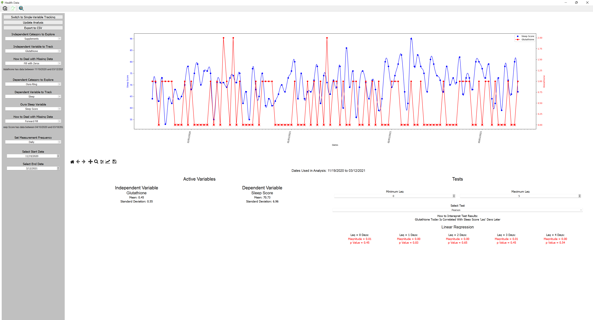

# HealthHack Data Logging and Analysis

What's the point of using a fitness tracker if you can't incorporate any data from other sources in its analysis?  Tired of logging the same workouts in multiple different apps so that each app can make its own conclusions about your health?

HealthHack solves these problems by bringing health data from any source into a unified environment so that you can interpret it yourself.  We provide some basic data cleaning strategies and statistical tests so even someone with no statistics experience can gain insights into their own health.

## Goal
To develop a desktop application capable of logging data and pulling data from different sources.  These different sources of data can then be cleaned and analyzed to find insights across sources that no single app supports.

## Currently Support Data Sources
1. Data Manually Logged Within the App
2. Oura Ring
3. MyFitnessPal
4. HabitBull
5. Any other form of data which is formatted by the app's standard

## Setup Instructions
Still Under Development

## Screenshots

The home page controls what kind of data can be tracked and analyzed.  It's easy to add a new category of data for manual entry.

Once a category is created, multiple variables can be added.

A simple GUI enables logging the relevant entries for each type of data

The fun begins once data is collected.  The analysis dashboard provides a level of control over your data that no health app will give you directly.  Plot up to two data sources side-by-side and run various statistical tests to find correlations and causality.

This dashboard can also be used to clean data in a variety of different ways.  The cleaned data can be output to CSV for your own purposes.

Forgot to wear your fitness tracker during sleep?  Control how missing data is handled across all sources by excluding it or filling with the most reasonable values.

The above example shows that I can be reasonably sure that taking glutathione does not impact by sleep quality. Now I know! 